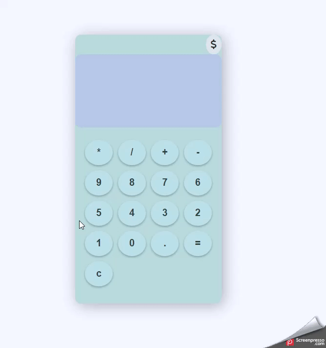

# Calculator
A basic calculator which also implements exchange rate calculations

**Features**
- Perform Basic Arithmetic calculations.
  - Addition
  - Subtraction
  - Multiplication
  - Division
- Real-time Exchange Rates
   - Fetches the latest exchange rates from ExchangerateAPI.
   - Supports 40+ currencies for conversion.

**Preview**

  
